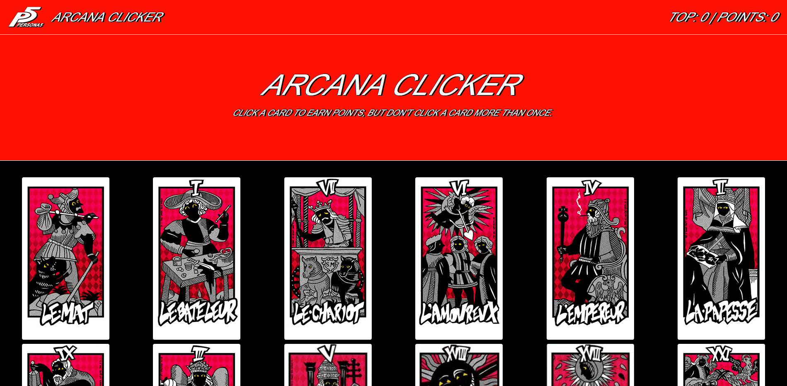

# clicky-game

[See this app in action.](https://cisigep.github.io/clicky-game/)

A simple image clicker game where the user needs to click an image that has not been clicked before to earn points. Created with React.

## User Interaction

1. User clicks on an image to play the game.

2. Game increments the points if the image hasn't been clicked yet in the game or resets if it has.